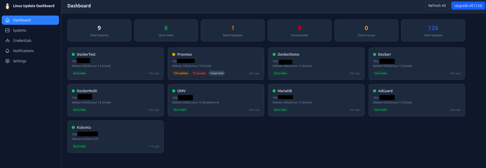
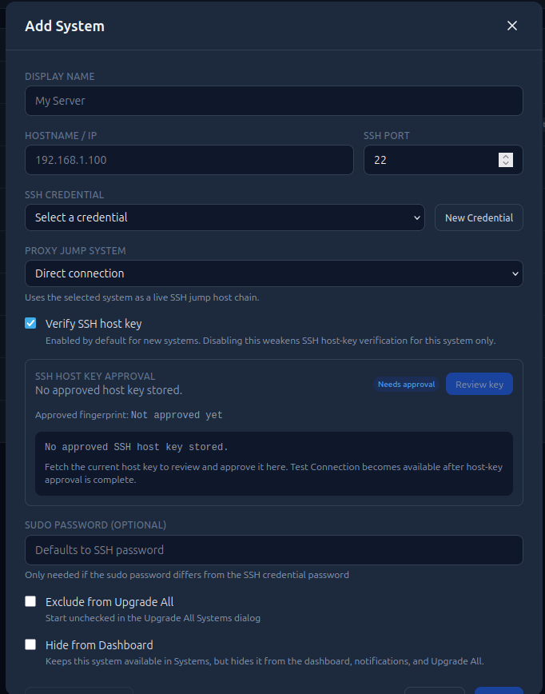
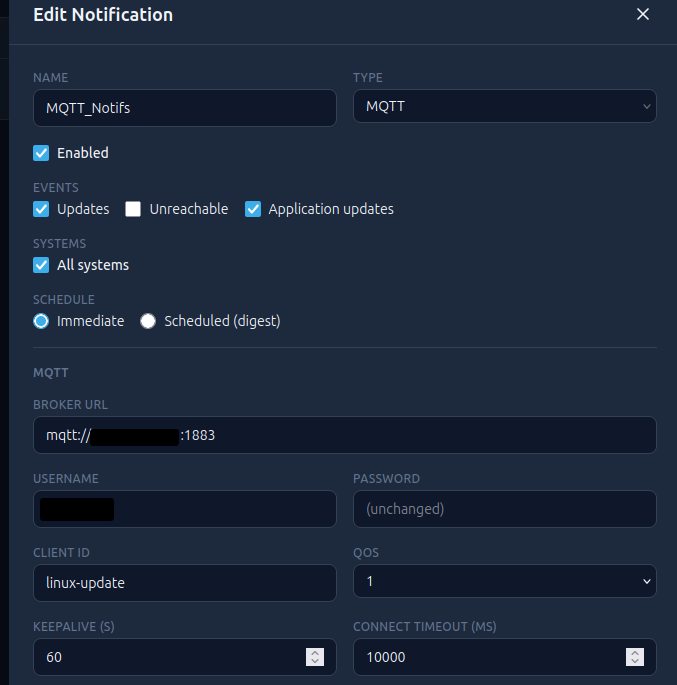
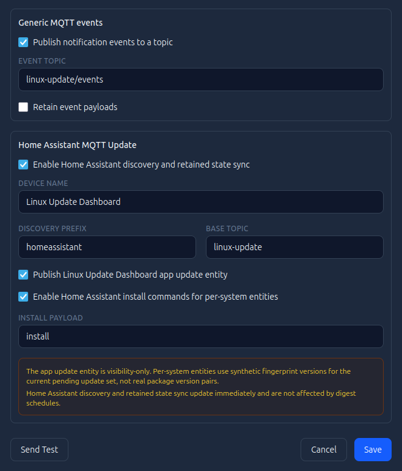
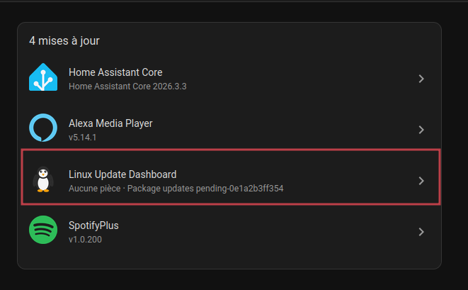
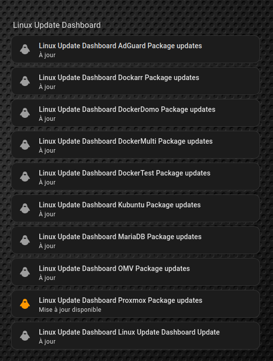
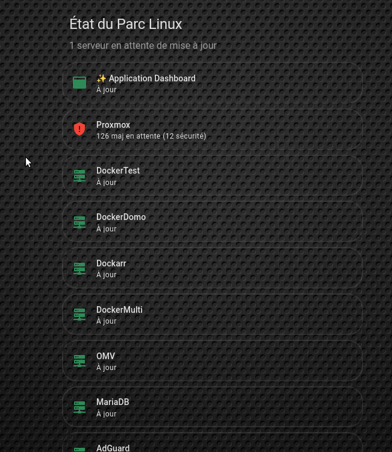
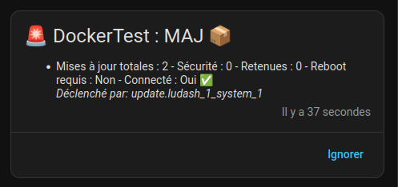
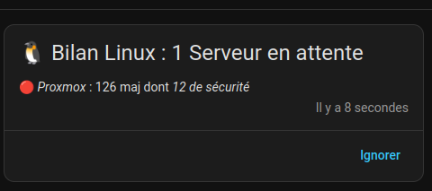

Bonjour à tous,

Si tout comme moi, vous avez plusieurs hôtes, voire même des VM sous Linux, le suivi des mises à jour système n'est pas toujours évident.
Connexion en SSH à l'hôte, lancer un `apt update` pour vérifier s'il y a des mises à jour, et répéter l'opération sur chaque machine... 
Pas vraiment de centralisation possible, ni de monitoring efficace et simple.

Mais il y a quelques semaines, j'ai découvert une excellente petite application, auto-hébergée et compatible Home Assistant via MQTT.
Bien que le projet soit encore très jeune (le dépôt GitHub a été créé en Février 2026 et commence tout juste à se faire connaître), il est déjà incroyablement prometteur et fonctionnel :

👉 **[Linux Update Dashboard](https://github.com/TheDuffman85/linux-update-dashboard)**



Voyons donc pas à pas la mise en place de cette solution ! Dans mon infrastructure.

---

## 🚀 Tutoriel d'Installation Docker

Voici un guide pas à pas pour installer **Linux Update Dashboard** à l'aide de Docker Compose. C'est la méthode recommandée pour garder le contrôle sur vos données et configurer facilement les intégrations avec Home Assistant.

### Étape 1 : Préparation de la clé de chiffrement forte

Avant toute chose, l'application a besoin d'une clé de chiffrement robuste (`LUDASH_ENCRYPTION_KEY`). C'est ce qui lui permet de stocker de façon ultra-sécurisée les identifiants et clés SSH de vos serveurs (pour exécuter plus tard les commandes "Upgrade").

1. Ouvrez votre terminal (ou connectez-vous au serveur hôte) et générez la clé avec cette commande native Linux :
   ```bash
   openssl rand -base64 32
   ```
2. **Copiez précieusement** la longue chaîne de caractères qui s'affiche, vous allez en avoir besoin juste après !

### Étape 2 : Création du fichier `docker-compose.yaml`

Dans votre gestionnaire de fichiers ou via Portainer, créez une nouvelle stack `docker-compose.yaml` avec la structure suivante :

```yaml
services:
  dashboard:
    image: ghcr.io/theduffman85/linux-update-dashboard:latest
    container_name: linux-update-dashboard
    restart: unless-stopped
    ports:
      - "3001:3001"
    volumes:
      - dashboard_data:/data
    environment:
      # --- Configurations vitales ---
      - TZ=Europe/Paris # Requis pour la cohérence des planifications
      - LUDASH_ENCRYPTION_KEY=COLLEZ_VOTRE_CLE_ICI
      - LUDASH_DB_PATH=/data/dashboard.db
      - NODE_ENV=production
      
      # --- Intégration Home Assistant (Auto-Discovery) ---
      # Permet à HA de rapatrier localement l'URL des icônes
      - LUDASH_BASE_URL=http://<IP_DU_SERVEUR_DOCKER>:3001
      
      # À décommenter UNIQUEMENT si l'application est derrière un reverse proxy pour un accès web extérieur (ex: NPM)
      # - LUDASH_TRUST_PROXY=true

volumes:
  dashboard_data:
```

**⚠️ Précisions sur les variables d'environnement cruciales :**
- **`LUDASH_ENCRYPTION_KEY`** : Collez exactement la clé cryptographique générée à l'étape 1.
- **`LUDASH_BASE_URL`** : Remplacez `<IP_DU_SERVEUR_DOCKER>` par l'IP réelle de la machine qui fait tourner ce conteneur. C'est critique pour MQTT Auto-Discovery, car Home Assistant récupère l'image du logo de l'intégration à partir de cette adresse.

### Étape 3 : Lancement de l'application

Une fois le fichier complété et sauvegardé, lancez la stack :

```bash
docker compose up -d
```

L'image est très légère. Le serveur Node.js et la base de données SQLite vont s'initialiser instantanément, en sauvegardant le tout dans le volume persistant.

### Étape 4 : Première connexion et Ajout des serveurs

Ouvrez un navigateur web et rendez-vous sur le port 3001 : `http://<IP_DU_SERVEUR_DOCKER>:3001`

1. Lors de la toute première visite, l'application vous invitera obligatoirement à créer le compte Administrateur local (choisissez un mot de passe très robuste !).
2. Ajoutez ensuite votre première machine Linux via le bouton **"Add System"** (un simple login/mot de passe SSH ou une clé d'identification suffit).



### Étape 5 : Lier la flotte à Home Assistant via MQTT

Enfin, pour que vos serveurs soient propulsés sous forme d'Appareils `update` dans HA, configurez l'onglet **"Settings -> Notifications -> MQTT"** de l'application :




Et voilà ! L'Auto-Discovery fera le reste dans Home Assistant. Vous retrouverez l'ensemble de votre flotte parfaitement intégrée pour vos dashboards et automatisations.

---

## 🖥️ Carte Dashboard (Lovelace)

Voici une vue de Linux Update Dashboard avec l'intégralité de ma flotte Linux :


De plus, l'Auto-Discovery fait remonter intelligemment toutes ces alertes directement dans la page native des **Mises à jour** du menu système de Home Assistant (au même titre qu'une mise à jour du Core ou de HACS) :



Et voici le résultat de la carte native par défaut engendrée :



Cependant, comme on peut le constater sur ces deux captures, ce rendu natif manque d'ergonomie et n'est pas très lisible au premier coup d'œil. 
Ce n'est pas directement la faute de Home Assistant : cela vient en grande partie de la structure actuelle des topics MQTT envoyés par l'application (assez jeune, souvenez-vous), qui génère des labels bruts de type "Package updates pending-XYZ". Il faut donc obligatoirement cliquer manuellement sur chaque entrée pour déchiffrer quel est le serveur et voir le statut de criticité.

Pour pallier ce comportement natif des entités d'origine, j'ai décidé de créer ma propre carte personnalisée pour l'intégrer harmonieusement dans mon dashboard principal. Elle va piocher dynamiquement au niveau des attributs des entités, et les affiche proprement au format Mushroom.

Voici un aperçu de l'intégration finale animée :



Et voici le code complet à coller en Carte manuelle (il nécessite les intégrations HACS **`auto-entities`**, **`Mushroom Cards`** et **`Card-Mod`**). Il intègre des modifications CSS poussées (effets glassmorphism, transparences, bordures arrondies) pour parfaitement s'intégrer à mon design général.

```yaml
type: vertical-stack
cards:
  # 1. LE TITRE DYNAMIQUE
  - type: custom:mushroom-title-card
    title: État du Parc Linux
    subtitle: >-
      
       Flotte 100% à jour  1 serveur en attente de mise à jour  {{ pending }} serveurs en attente de mise à jour 

  # 2. LA LISTE AVEC TEMPLATE TOTAL ET CARD-MOD (Design Streamline: Contour fin & Ombre)
  - type: custom:auto-entities
    card:
      type: vertical-stack
    card_param: cards
    sort:
      method: attribute
      attribute: update_count
      reverse: true
    filter:
      template: >
        
        
        
          
          {# VARIABLES DE BASE #}
          
          
          
          
          
          
          {# -- SOUS-TITRE DYNAMIQUE (Détail des MAJ) -- #}
          
            
          
            
          
            
            
              
            
            
              
            
          
          
          {# -- COULEUR INTELLIGENTE -- #}
          
            
          
            
          
            
          

          {# -- ICÔNES PARLANTE -- #}
          
            
          
            
          
            
          
            
          
          
          {# -- GÉNÉRATION DE LA CARTE AVEC CARD-MOD (Effet Streamline Glassmorphism) -- #}
          {% set card = {
            'type': 'custom:mushroom-template-card',
            'entity': state.entity_id,
            'primary': nom_propre,
            'secondary': detail,
            'icon': icone,
            'icon_color': couleur,
            'tap_action': { 'action': 'more-info' },
            'card_mod': {
               'style': "ha-card {\n  background: transparent;\n  border: 1px solid rgba(150, 150, 150, 0.15);\n  box-shadow: 0px 4px 10px rgba(0, 0, 0, 0.05);\n  border-radius: 24px;\n  padding-top: 5px;\n  padding-bottom: 5px;\n}"
            }
          } %}
          
          
        
        
        {{ ns.cards }}
```

---

## 🔔 Automatisations & Notifications

Même si avoir une belle carte avec les informations en clair est très agréable (permettant en plus de lancer les mises à jour directement depuis HA), j'aime aussi avoir des notifications instantanées.

Pour l'instant, j'utilise deux automatisations. Pour faire simple et le temps de les éprouver, j'utilise une simple notification persistante native dans HA (via le panneau latéral).

**1️⃣ La première automatisation : Alerte Critique**  
Elle se déclenche en temps réel lorsqu'un serveur détecte une *nouvelle* mise à jour (application interne, perte de connexion, patch de sécurité, ou redémarrage requis). Le code est ultra-sécurisé pour éviter les faux positifs et gère le pluriel de manière dynamique.

Voici ce que ça donne concrètement à la réception :


```yaml
alias: "🚨 Alerte : Mises à jour & État Serveurs Linux"
description: "Alerte instantanée dès qu'un serveur a de nouveaux paquets (surtout de sécurité), nécessite un redémarrage, ou s'il perd sa connexion."
mode: queued
max: 10

# 1. DÉCLENCHEURS (LISTE EXPLICITE POUR ZÉRO IMPACT CPU ET TRACES LISIBLES)
# Note : Entités séparées volontairement pour garder une interface visuelle Home Assistant aérée.
trigger:
  - platform: state
    entity_id: update.ludash_1_system_1
  - platform: state
    entity_id: update.ludash_1_system_2
  - platform: state
    entity_id: update.ludash_1_system_3
  - platform: state
    entity_id: update.ludash_1_system_4
  - platform: state
    entity_id: update.ludash_1_system_5
  - platform: state
    entity_id: update.ludash_1_system_6
  - platform: state
    entity_id: update.ludash_1_system_7
  - platform: state
    entity_id: update.ludash_1_system_8
  - platform: state
    entity_id: update.ludash_1_system_9
  - platform: state
    entity_id: update.ludash_1_app_update
  # (Pense à remplacer ces IDs génériques par les tiens)

# 2. CONDITIONS (FILTRER LES "AGGRAVATIONS" UNIQUEMENT)
condition:
  - condition: template
    value_template: "{{ trigger.to_state is defined and trigger.to_state is not none and trigger.from_state is defined and trigger.from_state is not none }}"
  
  - condition: template
    value_template: >
      
      
      
      {# Tests d'incrémentation (s'assurer qu'il y a PLUS de MAJ qu'avant) #}
      
      
      
      
      {# Tests true/false #}
      
      
      
      {# Test Dashboard app lui-même (qui n'a pas d'update_count) #}
      
      
      {{ maj_up or sec_up or kep_up or reboot_now or perdu or app_up }}

# 3. ACTIONS
action:
  # 3.1 ENREGISTREMENT DES VARIABLES DE LA MACHINE DÉCLENCHEUSE
  - variables:
      nom: "{{ trigger.to_state.attributes.system.name if trigger.to_state.attributes.system is defined else 'Linux Update Dashboard' }}"
      total: "{{ trigger.to_state.attributes.update_count | default(0) }}"
      secu: "{{ trigger.to_state.attributes.security_update_count | default(0) }}"
      kept: "{{ trigger.to_state.attributes.kept_back_update_count | default(0) }}"
      reboot: "{{ trigger.to_state.attributes.needs_reboot | default(false) }}"
      reachable: "{{ trigger.to_state.attributes.reachable | default(true) }}"
      
      # 3.2 DÉDUCTION DE LA CAUSE PRÉCISE DE L'ALERTE POUR L'AFFICHAGE DU TEXTE
      cause: >
        
        
        
          Nouvelle version de l'application ✨
        
          Alerte incident : Perte de connexion 💥
        
          
          
            
          
            
          
          
            
          
          {{ msg | join(' + ') if msg | length > 0 else 'Mise à jour d\'état ℹ️' }}
        

      # 3.3 CONSTRUCTION DU MESSAGE (RÉUTILISABLE)
      notif_titre: "🚨 {{ nom }} : {{ cause }}"
      generated_message: >
        
        
        Une nouvelle mise à jour de l'application Dashboard est prête !
        - Version installée : {{ new.get('installed_version', 'Inconnue') }}
        - Version disponible : {{ new.get('latest_version', 'Inconnue') }}
        
        - Mises à jour totales : {{ total }}
        - Sécurité : {{ secu }}
        - Retenues : {{ kept }}
        - Reboot requis : {{ 'Oui 🚩' if reboot else 'Non' }}
        - Connecté : {{ 'Oui ✅' if reachable else 'Non ❌' }}
        
        
        *Déclenché par: {{ trigger.entity_id }}*

  # 3.4 ENVOI DE LA NOTIFICATION PERSISTANTE NATIVE HOME ASSISTANT
  - action: persistent_notification.create
    data:
      title: "{{ notif_titre }}"
      message: "{{ generated_message }}"
      notification_id: "lud_alert_{{ trigger.entity_id }}"
```

**2️⃣ La deuxième automatisation : Bilan Hebdomadaire**  
C'est un condensé exhaustif de l'état de tout votre parc, envoyé de façon planifiée (ici, tous les vendredis à 20h15). J'ai configuré la notification avec le même `notification_id` pour que le message se mette à jour silencieusement au lieu de spammer l'historique de HA !

Voici un aperçu de ce récapitulatif de fin de semaine :


```yaml
alias: "🗓️ Bilan Hebdomadaire Mises à jour Serveurs Linux"
description: >
  Vérifie l'état de tous les serveurs le Vendredi à 20h15.
  Génère un rapport dynamique réutilisable pour de multiples canaux de notification.
mode: single

# 1. DÉCLENCHEUR (LE VENDREDI À 20H15)
trigger:
  - platform: time
    at: "20:15:00"
    weekday:
      - fri

# 2. ACTIONS
action:
  # 2.1 DÉTECTION DES MACHINES AVEC MAJ DISPONIBLES ET DE L'APP ELLE-MÊME
  - variables:
      serveurs_maj: >
        
        
          
            
          
        
        {{ ns.liste }}
      nb_serveurs: "{{ serveurs_maj | length }}"

      # L'application dashboard elle-même (qui n'a volontairement pas d'update_count)
      app_update_presente: >
        
        
          
             
          
        
        {{ ns.dispo }}

  # 2.2 GÉNÉRATION DU RAPPORT (VARIABLES RÉUTILISABLES)
  # Stocke le message complet pour pouvoir l'envoyer facilement sur Discord, Telegram, HA, etc.
  - variables:
      # Titre générique
      notif_titre: >
        
        
        🐧 Bilan Linux : Flotte 100% Opérationnelle ✅
        
        🐧 Bilan Linux : Mise à jour Dashboard dispo !
        
        🐧 Bilan Linux : 1 Serveur{{ suffix }} en attente
        
        🐧 Bilan Linux : {{ nb_serveurs }} Serveurs{{ suffix }} en attente
        
      
      # Couleur par défaut (SeaGreen)
      notif_couleur: "#2E8B57" # SeaGreen
      
      # Corps du message
      generated_message: >
        
        
        {# Si absolument TOUT est à jour #}
        
          
        
        
        {# Ajout de la MAJ de l'appli au tout début si elle existe #}
        
           
             
               
               
             
           
        

        
          
          
          
          
          
          {# Définition de l'icône prioritaire #}
          
          
          {# Construction de la ligne de résumé du serveur #}
          
          
            
          
          
            
          
          
          
        
        {{ ns.msg }}

  # 2.3 ENVOI : NOTIFICATION PERSISTANTE HOME ASSISTANT
  - action: persistent_notification.create
    data:
      title: "{{ notif_titre }}"
      message: "{{ generated_message }}"
      notification_id: "lud_bilan_hebdo"
```
Avec tout ça, je suis immédiatement alerté dès qu'une nouvelle mise à jour fait son apparition sur l'un de mes serveurs. Et chaque vendredi soir, pendant que je déguste un petit rhum bien mérité, je reçois mon récapitulatif global : je sais ainsi d'emblée si je vais devoir passer une partie de mon week-end à scruter des changelogs et lancer des correctifs... ou si je peux me détendre l'esprit tranquille ! 🍹🐧